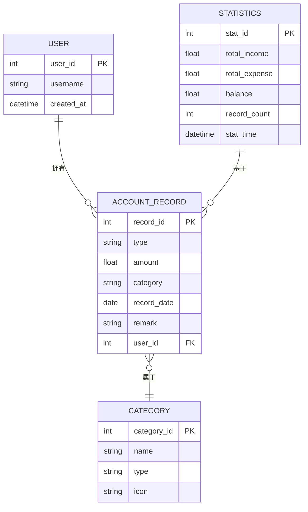

```mermaid
erDiagram
    USER {
        int user_id PK
        string username
        datetime created_at
    }
    
    ACCOUNT_RECORD {
        int record_id PK
        string type
        float amount
        string category
        date record_date
        string remark
        int user_id FK
    }
    
    CATEGORY {
        int category_id PK
        string name
        string type
        string icon
    }
    
    STATISTICS {
        int stat_id PK
        float total_income
        float total_expense
        float balance
        int record_count
        datetime stat_time
    }
    
    USER ||--o{ ACCOUNT_RECORD : "拥有"
    ACCOUNT_RECORD }o--|| CATEGORY : "属于"
    STATISTICS ||--o{ ACCOUNT_RECORD : "基于"
```
