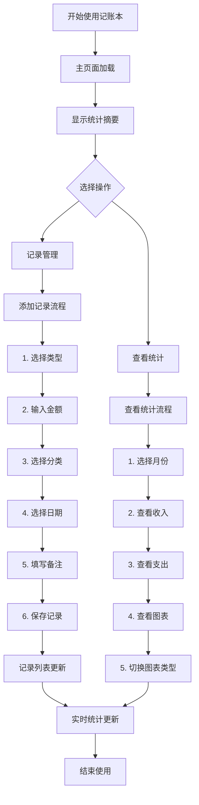

```mermaid
flowchart TD
    Start[开始使用记账本] --> Load[主页面加载]
    Load --> Dashboard[显示统计摘要]
    Dashboard --> Choice{选择操作}
    
    Choice --> Record[记录管理]
    Choice --> Stats[查看统计]
    
    Record --> Add[添加记录流程]
    Add --> Step1[1. 选择类型]
    Step1 --> Step2[2. 输入金额]
    Step2 --> Step3[3. 选择分类]
    Step3 --> Step4[4. 选择日期]
    Step4 --> Step5[5. 填写备注]
    Step5 --> Step6[6. 保存记录]
    Step6 --> Update[记录列表更新]
    
    Stats --> View[查看统计流程]
    View --> Month[1. 选择月份]
    Month --> Income[2. 查看收入]
    Income --> Expense[3. 查看支出]
    Expense --> Chart[4. 查看图表]
    Chart --> Switch[5. 切换图表类型]
    
    Update --> RealTime[实时统计更新]
    Switch --> RealTime
    RealTime --> End[结束使用]
```
