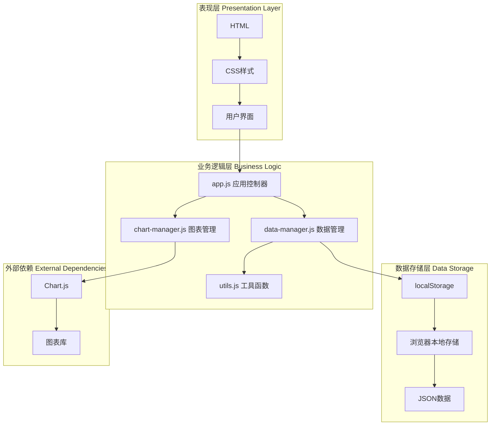

```mermaid
graph TB
    subgraph "表现层 Presentation Layer"
        A1[HTML] --> A2[CSS样式]
        A2 --> A3[用户界面]
    end
    
    subgraph "业务逻辑层 Business Logic"
        B1[app.js 应用控制器] --> B2[data-manager.js 数据管理]
        B1 --> B3[chart-manager.js 图表管理]
        B2 --> B4[utils.js 工具函数]
    end
    
    subgraph "数据存储层 Data Storage"
        C1[localStorage] --> C2[浏览器本地存储]
        C2 --> C3[JSON数据]
    end
    
    subgraph "外部依赖 External Dependencies"
        D1[Chart.js] --> D2[图表库]
    end
    
    A3 --> B1
    B2 --> C1
    B3 --> D1
```
