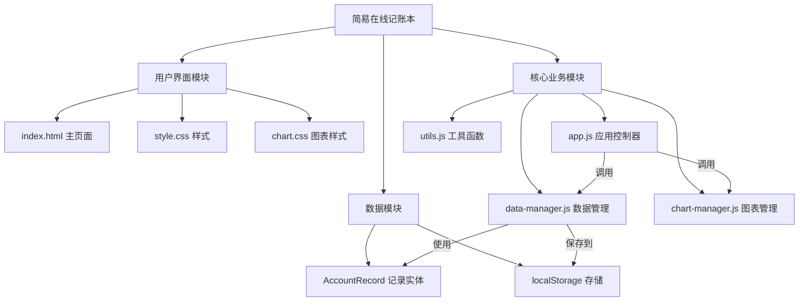

```mermaid
graph TD
    A[简易在线记账本] --> B[用户界面模块]
    A --> C[核心业务模块]
    A --> D[数据模块]
    
    B --> B1[index.html 主页面]
    B --> B2[style.css 样式]
    B --> B3[chart.css 图表样式]
    
    C --> C1[app.js 应用控制器]
    C --> C2[data-manager.js 数据管理]
    C --> C3[chart-manager.js 图表管理]
    C --> C4[utils.js 工具函数]
    
    D --> D1[AccountRecord 记录实体]
    D --> D2[localStorage 存储]
    
    C1 -->|调用| C2
    C1 -->|调用| C3
    C2 -->|使用| D1
    C2 -->|保存到| D2
```
