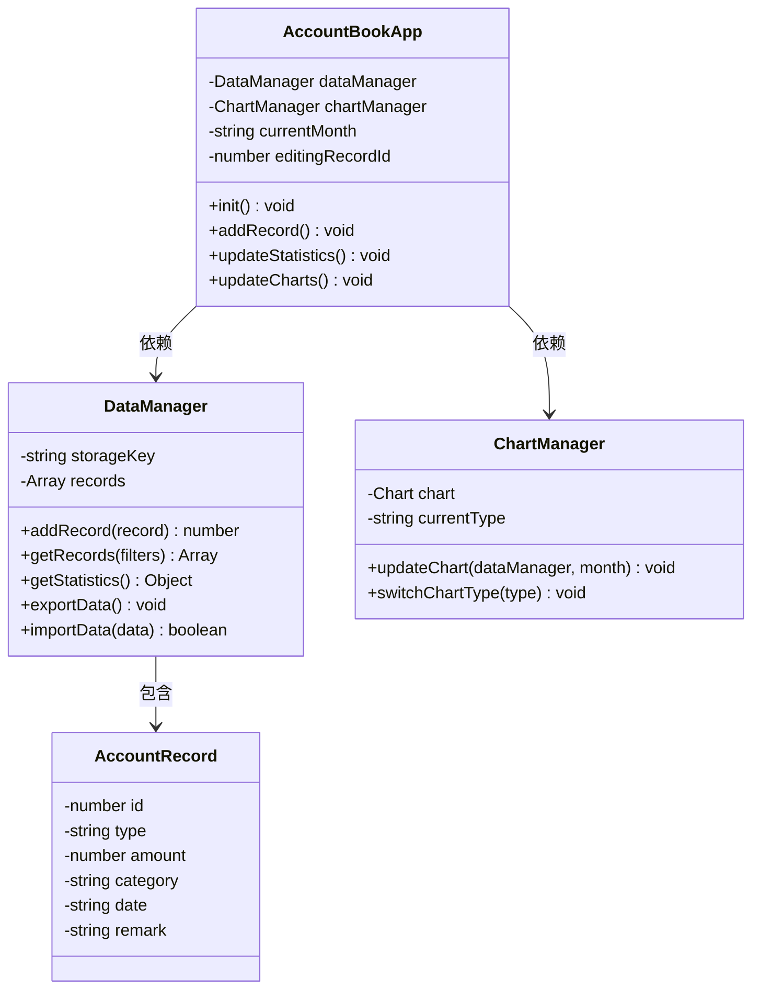

```mermaid
classDiagram
    class AccountBookApp {
        -DataManager dataManager
        -ChartManager chartManager
        -string currentMonth
        -number editingRecordId
        +init() void
        +addRecord() void
        +updateStatistics() void
        +updateCharts() void
    }
    
    class DataManager {
        -string storageKey
        -Array records
        +addRecord(record) number
        +getRecords(filters) Array
        +getStatistics() Object
        +exportData() void
        +importData(data) boolean
    }
    
    class ChartManager {
        -Chart chart
        -string currentType
        +updateChart(dataManager, month) void
        +switchChartType(type) void
    }
    
    class AccountRecord {
        -number id
        -string type
        -number amount
        -string category
        -string date
        -string remark
    }
    
    AccountBookApp --> DataManager : 依赖
    AccountBookApp --> ChartManager : 依赖
    DataManager --> AccountRecord : 包含
```
